# 🏗️ Arsitektur Sistem HabitMate

## Ringkasan Aplikasi

**HabitMate** adalah aplikasi Android untuk tracking kebiasaan (habit tracker) yang membantu pengguna membangun dan memantau kebiasaan harian mereka. Aplikasi ini dibangun menggunakan teknologi modern Android development dengan fokus pada arsitektur yang bersih dan maintainable.

---

## 🛠️ Tech Stack

### Bahasa Pemrograman
| Teknologi | Versi | Keterangan |
|-----------|-------|------------|
| **Kotlin** | 2.0.21 | Bahasa utama untuk development Android |
| **Java Compatibility** | 11 | Target JVM |

### Framework & Library Utama

| Kategori | Library | Versi | Fungsi |
|----------|---------|-------|--------|
| **UI Framework** | Jetpack Compose | BOM 2024.09.00 | Modern declarative UI toolkit |
| **Material Design** | Material 3 | - | Design system dan komponen UI |
| **Navigation** | Navigation Compose | 2.8.0 | Navigasi antar screen |
| **Database** | Room | 2.6.1 | Local database persistence |
| **Lifecycle** | Lifecycle Runtime KTX | 2.10.0 | Lifecycle-aware components |
| **Annotation Processing** | KSP | 2.0.21-1.0.25 | Kotlin Symbol Processing untuk Room |

### Build Tools
| Tool | Versi |
|------|-------|
| Android Gradle Plugin | 8.13.1 |
| Kotlin Compose Plugin | 2.0.21 |
| Min SDK | 26 (Android 8.0) |
| Target SDK | 36 |
| Compile SDK | 36 |

---

## 📐 Arsitektur Aplikasi

Aplikasi ini mengikuti pola arsitektur **MVVM (Model-View-ViewModel)** yang direkomendasikan oleh Google untuk Android development.

```mermaid
flowchart TB
    subgraph UI["🎨 UI Layer (Jetpack Compose)"]
        MainActivity
        SplashScreen
        HomeScreen
        CreateHabitScreen
        HabitsManagerScreen
        HabitDetailScreen
    end
    
    subgraph VM["🧠 ViewModel Layer"]
        HomeViewModel
    end
    
    subgraph REPO["📦 Repository Layer"]
        HabitRepository
    end
    
    subgraph DATA["💾 Data Layer (Room)"]
        HabitDatabase
        HabitDao
        HabitHistoryDao
        HabitEntity
        HabitHistoryEntity
    end
    
    UI --> VM
    VM --> REPO
    REPO --> DATA
```



---

## 📁 Struktur Direktori

```
app/src/main/java/com/example/habitmate/
├── 📱 HabitMateApplication.kt    # Application class (DI container)
├── 🏠 MainActivity.kt            # Entry point & Navigation host
│
├── 📂 data/
│   ├── 📂 local/
│   │   ├── Converters.kt         # Type converters untuk Room
│   │   ├── HabitDao.kt           # Data Access Object untuk habits
│   │   ├── HabitDatabase.kt      # Room database configuration
│   │   ├── HabitEntity.kt        # Entity: habits table
│   │   ├── HabitHistoryDao.kt    # DAO untuk habit history
│   │   └── HabitHistoryEntity.kt # Entity: habit_history table
│   │
│   └── 📂 repository/
│       └── HabitRepository.kt    # Single source of truth
│
└── 📂 ui/
    ├── 📂 home/
    │   ├── HomeScreen.kt         # Main screen dengan daftar habits
    │   ├── HomeViewModel.kt      # ViewModel untuk home
    │   ├── CreateHabitScreen.kt  # Form membuat/edit habit
    │   ├── HabitDetailScreen.kt  # Detail habit
    │   └── HabitTemplateSheet.kt # Template pilihan habit
    │
    ├── 📂 habits/
    │   └── HabitsManagerScreen.kt # Manage semua habits
    │
    ├── 📂 splash/
    │   └── SplashScreen.kt       # Splash screen animasi
    │
    ├── 📂 stats/
    │   └── StatsScreen.kt        # Statistik habits
    │
    └── 📂 theme/
        ├── Color.kt              # Color palette
        ├── Theme.kt              # Material theme config
        └── Type.kt               # Typography
```

---

## � Penjelasan Detail Folder Data

### Folder: `data/local/`

Folder ini berisi semua komponen yang berhubungan dengan **penyimpanan data lokal** menggunakan Room Database.

#### 1. `Converters.kt` - Type Converters

File ini berisi **type converter** yang memungkinkan Room menyimpan tipe data kompleks yang tidak secara native didukung SQLite.

| Fungsi | Input | Output | Keterangan |
|--------|-------|--------|------------|
| `fromHabitTimeOfDay()` | `HabitTimeOfDay` enum | `String` | Konversi enum ke string untuk disimpan di DB |
| `toHabitTimeOfDay()` | `String` | `HabitTimeOfDay` enum | Konversi string dari DB ke enum |
| `fromBooleanList()` | `List<Boolean>` | `String` | Konversi list boolean jadi string "true,false,..." |
| `toBooleanList()` | `String` | `List<Boolean>` | Parse string kembali ke list boolean |

> 💡 **Contoh penggunaan:** Field `selectedDays` di HabitEntity adalah `List<Boolean>` yang dikonversi jadi string `"true,true,false,true,true,true,false"` untuk disimpan di SQLite.

---

#### 2. `HabitEntity.kt` - Entity Habits

File ini mendefinisikan **struktur tabel `habits`** di database. Merupakan data class dengan anotasi `@Entity`.

```kotlin
@Entity(tableName = "habits")
data class HabitEntity(
    @PrimaryKey(autoGenerate = true) val id: Int = 0,
    val title: String,           // Nama habit
    val emoji: String,           // Ikon emoji
    val timeOfDay: HabitTimeOfDay, // Waktu (Morning/Afternoon/Evening/Anytime)
    val unitLabel: String,       // Satuan (times, glasses, pages, dll)
    val current: Int = 0,        // Progress saat ini
    val target: Int = 1,         // Target harian
    val createdDate: Long,       // Tanggal dibuat (Epoch Day)
    val isDoneToday: Boolean = false,  // Status selesai hari ini
    val streak: Int = 0,         // Streak berturut-turut
    val selectedDays: List<Boolean>,   // Hari aktif [Sun, Mon, Tue, Wed, Thu, Fri, Sat]
    val weeklyTarget: Int = 0    // 0 = specific days, >0 = times per week
)
```

---

#### 3. `HabitHistoryEntity.kt` - Entity History

File ini mendefinisikan **struktur tabel `habit_history`** untuk menyimpan riwayat progress per tanggal.

```kotlin
@Entity(
    tableName = "habit_history",
    foreignKeys = [ForeignKey(
        entity = HabitEntity::class,
        parentColumns = ["id"],
        childColumns = ["habitId"],
        onDelete = ForeignKey.CASCADE  // Hapus history jika habit dihapus
    )],
    indices = [Index(value = ["habitId", "date"], unique = true)]
)
data class HabitHistoryEntity(
    @PrimaryKey(autoGenerate = true) val id: Int = 0,
    val habitId: Int,        // FK ke habits.id
    val date: Long,          // Tanggal (Epoch Day)
    val currentProgress: Int, // Progress di tanggal tersebut
    val isDone: Boolean      // Status selesai
)
```

> 💡 **Unique Index:** Kombinasi `habitId + date` bersifat unique, artinya setiap habit hanya bisa punya 1 record per tanggal.

---

#### 4. `HabitDao.kt` - Data Access Object Habits

File ini berisi **interface DAO** untuk operasi CRUD pada tabel `habits`.

| Method | Anotasi | Query/Action | Keterangan |
|--------|---------|--------------|------------|
| `getAllHabits()` | `@Query` | `SELECT * FROM habits ORDER BY createdDate DESC` | Ambil semua habits, urut terbaru |
| `insertHabit()` | `@Insert` | REPLACE on conflict | Tambah habit baru |
| `updateHabit()` | `@Update` | - | Update habit existing |
| `deleteHabit()` | `@Delete` | - | Hapus habit |
| `resetDailyProgress()` | `@Query` | `UPDATE habits SET current = 0, isDoneToday = 0` | Reset progress harian semua habit |

> 💡 **Flow:** `getAllHabits()` mengembalikan `Flow<List<HabitEntity>>` yang otomatis update saat data berubah.

---

#### 5. `HabitHistoryDao.kt` - Data Access Object History

File ini berisi **interface DAO** untuk operasi pada tabel `habit_history`.

| Method | Anotasi | Query/Action | Keterangan |
|--------|---------|--------------|------------|
| `getHistoryForDate()` | `@Query` | `SELECT * WHERE date = :date` | Ambil semua history di tanggal tertentu |
| `insertOrUpdateHistory()` | `@Insert` | REPLACE on conflict | Insert/update history (upsert) |
| `getHistoryForHabit()` | `@Query` | `SELECT * WHERE habitId = :habitId` | Ambil semua history untuk 1 habit |
| `getCompletedHistory()` | `@Query` | `SELECT * WHERE habitId = :id AND isDone = 1` | Ambil history yang completed saja (untuk statistik) |

---

#### 6. `HabitDatabase.kt` - Room Database Configuration

File ini adalah **konfigurasi utama Room Database** dengan pattern Singleton.

```kotlin
@Database(
    entities = [HabitEntity::class, HabitHistoryEntity::class],
    version = 5,
    exportSchema = false
)
@TypeConverters(Converters::class)
abstract class HabitDatabase : RoomDatabase() {
    abstract fun habitDao(): HabitDao
    abstract fun habitHistoryDao(): HabitHistoryDao
    
    companion object {
        @Volatile private var Instance: HabitDatabase? = null
        
        fun getDatabase(context: Context): HabitDatabase {
            return Instance ?: synchronized(this) {
                Room.databaseBuilder(context, HabitDatabase::class.java, "habit_database")
                    .fallbackToDestructiveMigration()
                    .build()
                    .also { Instance = it }
            }
        }
    }
}
```

| Komponen | Keterangan |
|----------|------------|
| `@Database` | Mendaftarkan entities dan version |
| `@TypeConverters` | Menggunakan Converters.kt |
| `Singleton` | Hanya 1 instance database di seluruh app |
| `fallbackToDestructiveMigration` | Hapus data lama jika schema berubah (development mode) |

---

### Folder: `data/repository/`

#### `HabitRepository.kt` - Single Source of Truth

File ini adalah **layer abstraksi** antara ViewModel dan DAO. Semua akses data dari UI harus melalui Repository.

```kotlin
class HabitRepository(
    private val habitDao: HabitDao, 
    private val historyDao: HabitHistoryDao
) {
    // Expose data as Flow
    val allHabits: Flow<List<HabitEntity>> = habitDao.getAllHabits()
    
    // Methods yang tersedia:
    fun getHistoryForDate(date: Long): Flow<List<HabitHistoryEntity>>
    suspend fun updateHabitProgress(habitId: Int, date: Long, progress: Int, isDone: Boolean)
    suspend fun insertHabit(habit: HabitEntity)
    suspend fun updateHabit(habit: HabitEntity)
    suspend fun deleteHabit(habit: HabitEntity)
    suspend fun resetDailyProgress()
}
```

| Fungsi Repository |
|-------------------|
| ✅ Menggabungkan multiple DAOs dalam 1 class |
| ✅ Menyediakan clean API untuk ViewModel |
| ✅ Memisahkan business logic dari data access |
| ✅ Memudahkan unit testing dengan mocking |

---

## �💾 Database Schema (Room)

### Tabel: `habits`

| Column | Type | Description |
|--------|------|-------------|
| `id` | INTEGER (PK, Auto) | Primary key |
| `title` | TEXT | Nama habit |
| `emoji` | TEXT | Emoji ikon |
| `timeOfDay` | TEXT | Waktu: Morning/Afternoon/Evening/Anytime |
| `unitLabel` | TEXT | Label satuan (times, glasses, dll) |
| `current` | INTEGER | Progress saat ini |
| `target` | INTEGER | Target harian |
| `createdDate` | INTEGER | Tanggal dibuat (Epoch Day) |
| `isDoneToday` | INTEGER | Status selesai hari ini |
| `streak` | INTEGER | Streak berturut-turut |
| `selectedDays` | TEXT | Hari aktif (JSON list boolean) |
| `weeklyTarget` | INTEGER | Target per minggu (0 = specific days) |

### Tabel: `habit_history`

| Column | Type | Description |
|--------|------|-------------|
| `id` | INTEGER (PK, Auto) | Primary key |
| `habitId` | INTEGER (FK) | Foreign key ke habits |
| `date` | INTEGER | Tanggal (Epoch Day) |
| `currentProgress` | INTEGER | Progress di tanggal tersebut |
| `isDone` | INTEGER | Status selesai |

> **Relasi:** `habit_history.habitId` → `habits.id` dengan `ON DELETE CASCADE`

---

## 🔄 Alur Data (Data Flow)


---

## 🧭 Navigation

Aplikasi menggunakan **Jetpack Navigation Compose** dengan routes berikut:

| Route | Screen | Deskripsi |
|-------|--------|-----------|
| `splash` | SplashScreen | Animasi splash |
| `home` | HabitMateHomeScreen | Halaman utama dengan list habits |
| `habits_manager` | HabitsManagerScreen | Kelola semua habits |
| `create_habit?habitId={id}&title={title}&emoji={emoji}` | CreateHabitScreen | Buat/edit habit |

### Transition Animations
- **Splash → Home:** Fade in/out (700ms)
- **Home → Habits Manager:** Slide left/right (400ms)
- **Home → Create Habit:** Slide up/down (400ms)

---

## 🏭 Dependency Injection

Aplikasi menggunakan **manual dependency injection** melalui `HabitMateApplication`:

```kotlin
class HabitMateApplication : Application() {
    val database by lazy { HabitDatabase.getDatabase(this) }
    val repository by lazy { 
        HabitRepository(database.habitDao(), database.habitHistoryDao()) 
    }
}
```

ViewModel dibuat menggunakan `ViewModelProvider.Factory` pattern.

---

## 🎨 UI Layer

### Compose Components
- **Material 3** sebagai design system
- **Extended Material Icons** untuk ikon tambahan
- Custom composables untuk:
  - Habit cards dengan animasi
  - Progress indicators
  - Date strip dengan scroll
  - Bottom navigation

### Theming
Menggunakan Material 3 dynamic theming dengan:
- Custom color palette (ocean theme)
- Typography konfigurasi
- Light theme focus

---

## ✅ Fitur Utama

1. **CRUD Habits** - Create, Read, Update, Delete kebiasaan
2. **Daily Tracking** - Pantau progress harian
3. **History Tracking** - Riwayat per tanggal dengan calendar view
4. **Streak System** - Hitung streak berturut-turut
5. **Flexible Scheduling** - Pilih hari spesifik atau target mingguan
6. **Templates** - Template habit siap pakai
7. **Time of Day Filter** - Filter berdasarkan waktu

---

## 📊 Diagram Komponen


---

## 🔧 Build Configuration

```kotlin
android {
    namespace = "com.example.habitmate"
    compileSdk = 36
    
    defaultConfig {
        applicationId = "com.example.habitmate"
        minSdk = 26
        targetSdk = 36
    }
    
    buildFeatures {
        compose = true
    }
}
```

---

## 📝 Catatan Pengembangan

- **Database Version:** 5 (dengan `fallbackToDestructiveMigration` untuk development)
- **Package Structure:** Mengikuti feature-based packaging
- **State Management:** Menggunakan Kotlin `StateFlow` dan `Flow`
- **Coroutines:** Semua operasi database async dengan suspend functions

---

*Dokumen ini dibuat otomatis berdasarkan analisis kode sumber HabitMate.*
