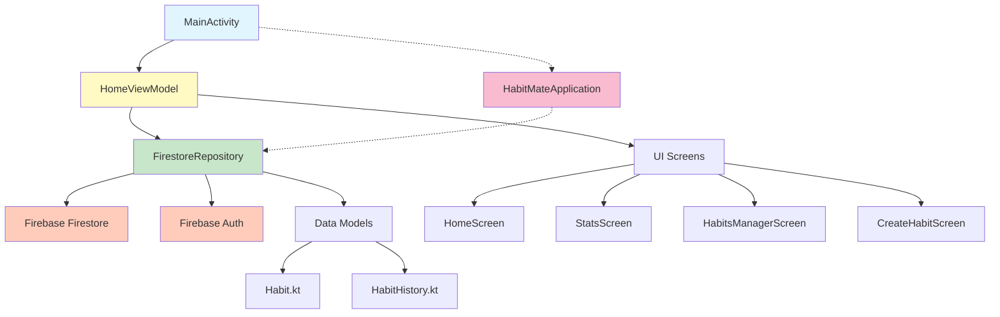

# Dokumentasi Arsitektur Kode HabitMate

Dokumen ini menjelaskan fungsi dan peran dari file-file utama dalam aplikasi HabitMate.

---

## Data Model Layer

### 1. Habit.kt
**Lokasi:** `app/src/main/java/com/example/habitmate/data/model/Habit.kt`

**Fungsi:**
- Model data utama untuk menyimpan informasi habit (kebiasaan) di Firestore
- Menggantikan `HabitEntity` yang sebelumnya digunakan untuk Room Database

**Isi Data:**
- `id`: ID unik dari dokumen Firestore
- `title`: Nama kebiasaan (contoh: "Minum air")
- `emoji`: Emoji representasi kebiasaan
- `timeOfDay`: Waktu pelaksanaan (MORNING, AFTERNOON, EVENING, ANYTIME)
- `unitLabel`: Label unit pengukuran (contoh: "gelas", "menit")
- `current`: Progress saat ini
- `target`: Target yang harus dicapai
- `isDoneToday`: Status apakah sudah selesai hari ini
- `streak`: Jumlah hari berturut-turut menyelesaikan habit
- `selectedDays`: List hari-hari yang dijadwalkan (List<Boolean>) 
- `weeklyTarget`: Target mingguan
- `createdDate`: Tanggal pembuatan dalam format epoch day

**Fitur Khusus:**
- Menggunakan anotasi `@DocumentId` untuk mengidentifikasi dokumen Firestore
- Menggunakan `@PropertyName` untuk mapping field Firestore dengan property Kotlin
- Memiliki no-arg constructor untuk deserialisasi Firestore
- Method `toTimeOfDay()` untuk konversi String ke enum `HabitTimeOfDay`

---

### 2. HabitHistory.kt
**Lokasi:** `app/src/main/java/com/example/habitmate/data/model/HabitHistory.kt`

**Fungsi:**
- Model data untuk menyimpan riwayat pencapaian habit per tanggal
- Menggantikan `HabitHistoryEntity` yang sebelumnya digunakan untuk Room Database
- Memungkinkan tracking progress harian dan perhitungan streak

**Isi Data:**
- `id`: ID unik dari dokumen Firestore
- `habitId`: Referensi ke habit yang terkait
- `date`: Tanggal dalam format epoch day (Long)
- `currentProgress`: Progress yang dicapai di tanggal tersebut
- `isDone`: Boolean apakah habit selesai di tanggal tersebut

**Fitur Khusus:**
- Menggunakan `@PropertyName` untuk field `isDone` karena Firestore menyimpannya sebagai "isDone"
- Memiliki no-arg constructor untuk deserialisasi Firestore
- Setiap entry merepresentasikan satu hari untuk satu habit

---

## Repository Layer

### 3. FirestoreRepository.kt
**Lokasi:** `app/src/main/java/com/example/habitmate/data/repository/FirestoreRepository.kt`

**Fungsi:**
- Repository utama untuk semua operasi database menggunakan Firebase Firestore
- Menggantikan Room Database dengan cloud storage
- Mengelola autentikasi anonim Firebase untuk isolasi data per pengguna

**Operasi Habits:**
- `allHabits`: Flow untuk mendapatkan semua habits dengan real-time updates
- `getHabitById()`: Mendapatkan satu habit berdasarkan ID
- `insertHabit()`: Menambahkan habit baru
- `updateHabit()`: Mengupdate habit yang sudah ada
- `deleteHabit()`: Menghapus habit beserta semua riwayatnya
- `updateStreak()`: Mengupdate streak habit

**Operasi History:**
- `allHistory`: Flow untuk mendapatkan semua riwayat dengan real-time updates
- `getHistoryForDate()`: Mendapatkan riwayat untuk tanggal tertentu
- `updateHabitProgress()`: Mengupdate atau membuat entry progress baru
- `getCompletedHistory()`: Mendapatkan semua riwayat yang sudah diselesaikan
- `refreshStreak()`: Menghitung ulang streak berdasarkan riwayat habit

**Fitur Khusus:**
- Menggunakan Firebase Anonymous Authentication untuk isolasi data per device
- Struktur Firestore: `/users/{userId}/habits/{habitId}` dan `/users/{userId}/history/{historyId}`
- Menggunakan Kotlin Flow dengan `callbackFlow` untuk real-time updates
- Algoritma perhitungan streak yang mempertimbangkan hari-hari terjadwal
- Error handling dan logging untuk debugging

---

### 4. HabitRepository.kt
**Lokasi:** `app/src/main/java/com/example/habitmate/data/repository/HabitRepository.kt`

**Status:** Repository lama yang sudah di-comment out

**Fungsi Sebelumnya:**
- Repository untuk operasi Room Database (local database)
- Mengelola `HabitEntity` dan `HabitHistoryEntity`

**Status Sekarang:**
- Sudah tidak digunakan karena migrasi ke Firestore
- Kode di-comment untuk referensi jika perlu kembali ke Room Database
- Digantikan sepenuhnya oleh `FirestoreRepository.kt`

**Catatan:**
- File ini bisa di-uncomment jika ingin kembali menggunakan Room Database
- Logika streak calculation yang sama juga diterapkan di `FirestoreRepository`

---

## ViewModel Layer

### 5. HomeViewModel.kt
**Lokasi:** `app/src/main/java/com/example/habitmate/ui/home/HomeViewModel.kt`

**Fungsi:**
- ViewModel utama yang mengelola state dan business logic untuk HomeScreen dan StatsScreen
- Mengikuti arsitektur MVVM (Model-View-ViewModel)
- Menghubungkan UI dengan `FirestoreRepository`

**State yang Dikelola:**
- `allHabits`: Semua habits untuk halaman master (Habits Manager)
- `selectedDate`: Tanggal yang dipilih user di HomeScreen
- `uiState`: Habits yang difilter berdasarkan tanggal dan hari terjadwal
- `statsUiState`: Habits untuk StatsScreen (selalu relatif terhadap hari ini)
- `hasAnimated`: State untuk animasi splash screen

**Operasi CRUD:**
- `addHabit()`: Menambahkan habit baru
- `updateHabit()`: Mengupdate habit yang sudah ada
- `deleteHabit()`: Menghapus habit
- `toggleHabit()`: Toggle/increment progress habit
- `decrementHabit()`: Mengurangi progress habit
- `resetHabit()`: Reset progress habit ke 0

**Logika Business:**
- `mapHabitToUi()`: Mapping data dari Firestore ke UI model dengan perhitungan:
  - Daily progress override dari history
  - Total completions
  - Success rate (7 hari terakhir)
  - Recent history (7 hari terakhir)
- Filter habits berdasarkan hari terjadwal (`selectedDays`)
- Menggabungkan data dari `allHabits`, `allHistory`, dan `historyForDate`

**Fitur Khusus:**
- Menggunakan Kotlin Flow untuk reactive programming
- `StateFlow` untuk expose data ke UI
- `combine()` dan `flatMapLatest()` untuk menggabungkan multiple flows
- ViewModelProvider.Factory untuk dependency injection `FirestoreRepository`
- Scope: `viewModelScope` untuk coroutine lifecycle-aware

---

## Application Layer

### 6. HabitMateApplication.kt
**Lokasi:** `app/src/main/java/com/example/habitmate/HabitMateApplication.kt`

**Fungsi:**
- Kelas Application yang menjadi entry point aplikasi
- Menginisialisasi komponen-komponen yang dibutuhkan di level aplikasi
- Menyediakan instance `FirestoreRepository` yang bisa diakses di seluruh aplikasi

**Inisialisasi:**
- `FirebaseApp.initializeApp()`: Menginisialisasi Firebase
- `NotificationHelper.createNotificationChannel()`: Membuat channel untuk notifikasi
- `repository.ensureAuthenticated()`: Memastikan user ter-autentikasi secara anonim

**Dependency Injection:**
- `repository`: Instance `FirestoreRepository` yang dibuat dengan `lazy` initialization
- Bisa diakses dari `MainActivity` atau komponen lain melalui `(application as HabitMateApplication).repository`

**Fitur Khusus:**
- `applicationScope`: CoroutineScope dengan `SupervisorJob` untuk operasi background
- Kode Room Database yang lama sudah di-comment out

---

## Activity Layer

### 7. MainActivity.kt
**Lokasi:** `app/src/main/java/com/example/habitmate/MainActivity.kt`

**Fungsi:**
- Activity utama dan satu-satunya di aplikasi
- Mengelola navigasi menggunakan Jetpack Navigation Compose
- Setup theme dan edge-to-edge display

**Navigation Routes:**
- `splash`: Splash screen dengan animasi
- `home`: Home screen utama dengan list habits
- `habits_manager`: Screen untuk manage semua habits
- `create_habit`: Screen untuk create/edit habit (dengan parameter optional)
- `settings`: Settings screen
- `terms`: Terms & Conditions screen
- `privacy`: Privacy Policy screen
- `about`: About app screen

**Animasi Transisi:**
- Fade in/out untuk splash → home
- Slide animations untuk navigasi horizontal (settings, habits manager)
- Slide up/down untuk modal screens (create habit)

**ViewModel Scope:**
- `HomeViewModel` dibuat di level `MainActivity` dan dishare ke semua composable screens
- Menggunakan `HomeViewModel.Factory` untuk inject `FirestoreRepository`

**Fitur Khusus:**
- `enableEdgeToEdge()`: Full screen dengan system bars
- Navigation dengan parameter (habitId, title, emoji)
- Pop-up behavior untuk mencegah back ke splash
- Edit mode detection untuk reuse `CreateHabitScreen`

---

## Diagram Arsitektur

---

## Alur Data

### Create/Update Habit:
1. User input di `CreateHabitScreen`
2. Callback `onSave` dipanggil di `MainActivity`
3. `MainActivity` memanggil `viewModel.addHabit()` atau `viewModel.updateHabit()`
4. `HomeViewModel` memanggil `repository.insertHabit()` atau `repository.updateHabit()`
5. `FirestoreRepository` menyimpan data ke Firestore
6. Firestore snapshot listener otomatis update `allHabits` Flow
7. UI otomatis refresh karena collect `StateFlow`

### Toggle/Update Progress:
1. User tap checkbox di `HomeScreen`
2. `viewModel.toggleHabit(id)` dipanggil
3. `HomeViewModel` menghitung progress baru dan status `isDone`
4. `repository.updateHabitProgress()` dipanggil
5. `repository.refreshStreak()` dipanggil untuk update streak
6. Firestore menyimpan/update `HabitHistory` entry
7. UI otomatis update melalui Flow reaktif

---

## Teknologi & Library

- **Firebase Firestore**: Cloud database untuk menyimpan habits dan history
- **Firebase Auth**: Anonymous authentication untuk isolasi data
- **Jetpack Compose**: Modern UI toolkit
- **Navigation Compose**: Navigasi antar screen
- **ViewModel & LiveData**: MVVM architecture
- **Kotlin Coroutines & Flow**: Async programming dan reactive streams
- **Material 3**: Design system

---

## Catatan Penting

1. **Migrasi dari Room ke Firestore**: Aplikasi ini awalnya menggunakan Room Database (local), kemudian migrasi ke Firestore (cloud). File-file lama masih ada tapi sudah di-comment.

2. **Anonymous Authentication**: Setiap device mendapatkan user ID unik, sehingga data tidak tercampur antar device.

3. **Real-time Updates**: Menggunakan Firestore snapshot listeners, sehingga jika ada perubahan data, UI langsung update tanpa perlu refresh manual.

4. **Streak Calculation**: Algoritma streak mempertimbangkan `selectedDays`, sehingga jika user hanya jadwal Senin-Jumat, tidak ngecek Sabtu-Minggu tidak akan break streak.

5. **Epoch Day**: Tanggal disimpan dalam format `Long` (epoch day) untuk memudahkan perhitungan dan konsistensi timezone.
